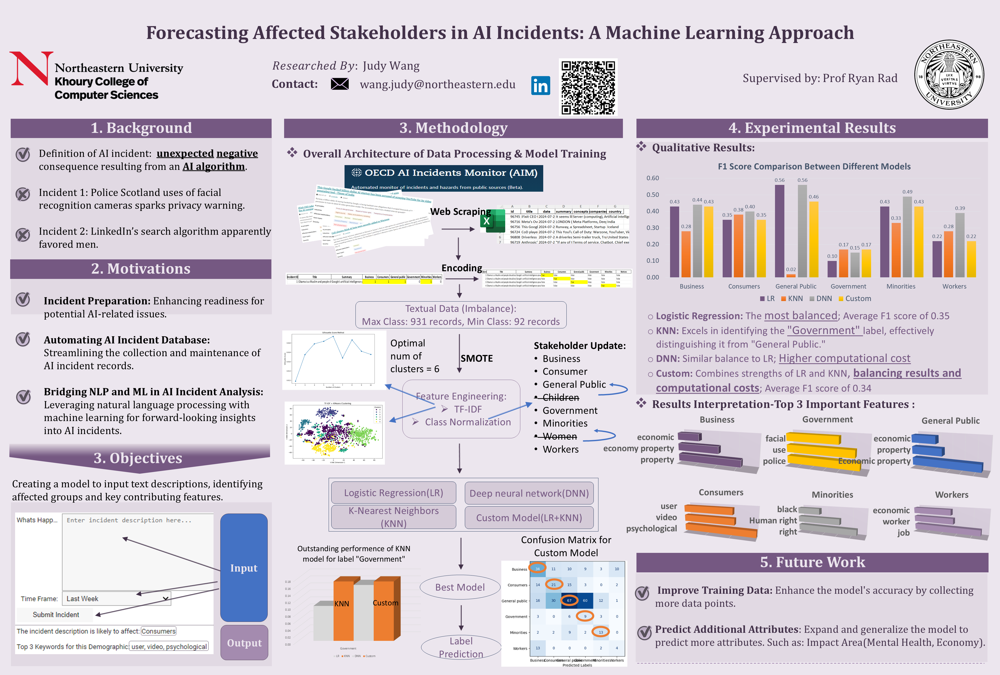
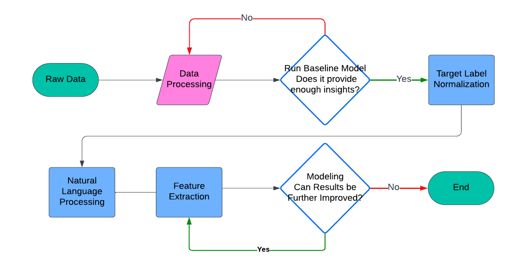

NEU Capstone Project: Predicting Who Is at Risk in AI Incidents: A  Machine Learning Approach

1-minute video Youtube Link: https://www.youtube.com/watch?v=lJQHfIMIAb4

Poster 

Project Description:

Background:
As AI systems increasingly integrate into various sectors, the risk of AI-related incidents grows. These incidents can have significant impacts on different stakeholders, making it critical to predict who might be affected. Traditional approaches have focused on documenting past incidents, but there is a need for a forward-looking, predictive approach that leverages modern machine learning techniques to enhance safety and ethical AI deployment.

Goal:
The goal of this project is to develop a predictive model that accurately identifies stakeholders who are likely to be impacted when AI-related incidents happen. By analyzing incident reports using natural language processing and machine learning, this model aims to provide actionable insights that can help mitigate risks and inform responsible AI design.

Research Objectives:

Data Analysis & Preprocessing: Utilize the OECD AI incident database to analyze and clean incident data for machine learning applications.

Feature Engineering: Apply natural language processing techniques.

Model Evaluation: Implement various machine learning models, including Logistic Regression, K-Nearest Neighbors (KNN), and Deep Neural Networks (DNN). Compare and evaluate the models based on metrics like F1 score, precision, and recall to determine the best-performing approach.

Custom Model Implementation: Develop a custom taxonomy model that combines the strengths of the best-performing models to enhance prediction accuracy and reduce computational costs.

Workflow:

Folders/Files Description

Code Folder:
    capstone_data_processing.py:
    This script handles the initial data cleaning and preprocessing steps. It applies natural language processing (NLP) techniques to process raw data, including tokenization, stop word removal, and lemmatization. The script also separates the data into training, testing, and validation sets, preparing it for model training.

    capstone_determine_num_clustering.py:
    This script determines the natural clusters within the raw data using the Elbow Method. It is essential for identifying the optimal number of clusters, which informs subsequent steps in model development and stakeholder categorization.

    capstone_model_names_plot.py:
    This script is responsible for training various machine learning models on the processed data. It also generates and plots necessary images and analyses, including confusion matrices, ROC curves, and other performance metrics to evaluate the models' effectiveness.

